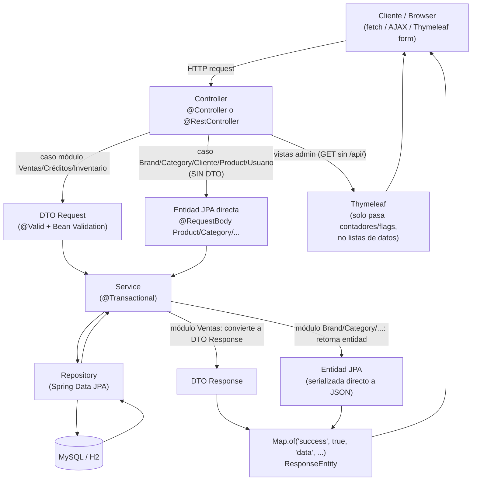

# Auditoría Backend — SneakerFever (Spring Boot + Thymeleaf + Bootstrap)

**Fecha:** 2026-08-25
**Alcance:** `src/main/java/com/example/acceso/**`, `application.properties`, plantillas Thymeleaf (`src/main/resources/templates/**`)
**Modo:** Solo análisis. Ningún archivo de código fue modificado.

---

## 1. Arquitectura general

### 1.1 Estructura de packages

```
com.example.acceso
├── AccesoApplication.java
├── config/
│   ├── SecurityConfig.java              → Bean BCryptPasswordEncoder
│   ├── SessionInterceptor.java          → Interceptor de sesión para /admin/**
│   ├── WebConfig.java                   → RestTemplate, resource handlers, CORS, interceptores
│   └── GlobalPersonalizacionAttributes.java → @ControllerAdvice, inyecta logo/slides en todas las vistas
├── controller/                          → 18 clases (17 @Controller/@RestController + 1 @ControllerAdvice de negocio)
├── service/                             → 10 clases + 1 interfaz (PerfilService/PerfilServiceImpl)
├── repository/                          → Interfaces JpaRepository (+ subpaquete RepositorioVentas/)
├── model/                               → 12 entidades raíz + subpaquetes EntidadesVenta/, EnumInventario/, EnumVentas/
└── dto/                                 → 14 DTOs (requests y responses), mezclados sin subcarpetas
```

- **controller/**: contiene tanto controladores MVC (`@Controller`) como un `@RestController` (`FileUploadController`) y dos `@ControllerAdvice` (`GlobalBrandAttributes`, `GlobalExceptionHandler`) que **no son controllers de endpoints** pero están ubicados en este paquete por conveniencia, no por convención arquitectónica.
- **model/**: mezcla entidades JPA raíz (`Product`, `Brand`, `Usuario`...) con subpaquetes temáticos (`EntidadesVenta`, `EnumInventario`, `EnumVentas`). Inconsistente: `Cliente` está en `model/` pero se usa casi exclusivamente en el dominio de ventas.
- **dto/**: sin separación entre `request` y `response`, ni entre dominios (ventas, inventario, clientes conviven en el mismo paquete plano).

### 1.2 ¿Separación real de capas?

**Parcial, y muy inconsistente entre módulos.** Hay dos patrones conviviendo en el mismo proyecto:

- **Patrón "correcto" (Ventas, Créditos, Inventario):** `VentaController` → `VentaService` → `VentaRepository`, con DTOs de request/response (`CrearVentaRequest`, `VentaResponse`, `CreditoVentaResponse`, `MovimientoInventarioResponse`). La lógica de negocio (cálculo de cuotas, descuento de stock, generación de comprobantes) vive en los Services y en métodos de dominio de las entidades (`CreditoVenta.calcularMontoConInteres()`, `Product.descontarStock()`).
- **Patrón "roto" (Brand, Category, Cliente, Product, Usuario, Perfil):** los controllers **exponen la entidad JPA directamente** como request y response del API REST (`@RequestBody Category categoria`, `@RequestBody Product producto`, `@RequestBody Cliente cliente`). No hay capa de mapeo; el controller manipula el objeto de persistencia directamente.

Ejemplos concretos de lógica de negocio filtrada al Controller (debería estar en el Service):
- `BrandController.validarNombre()` (líneas 406-421): validación de longitud de nombre duplicada con las anotaciones `@Size` de la entidad `Brand`.
- `PersonalizacionController.validarOrden()` (líneas 448-457): valida rango 1-5, lógica de dominio que pertenece a `PersonalizacionService`.
- `ProductController.actualizarProducto()` (líneas 370-438): copia manual de 11 campos de una entidad a otra dentro del controller — debería ser un método `ProductService.actualizarProducto(id, dto)`.
- `UsuarioController.contarAdministradoresActivos()` y las 3 validaciones de "último admin" (líneas 123-160, 223-234, 276-287): regla de negocio crítica de seguridad implementada en el controller, duplicada en tres métodos distintos.
- `ClienteController.obtenerEstadisticas()` y `ProductController.obtenerEstadisticas()`: agregaciones con `.stream().filter().count()` hechas en el controller en vez de una query de agregación en el repositorio o un método de Service.
- `WebController`: contiene llamadas HTTP salientes a un microservicio Node.js (`RestTemplate.getForObject`) directamente en el controller, sin capa de integración (`NodeIntegrationService`).

### 1.3 Flujo típico de una petición



**Observación clave:** las vistas Thymeleaf del panel admin (`admin/productos.html`, `admin/clientes.html`, etc.) **no reciben listas de datos por el Model** — el controller solo pasa contadores (`totalProductos`, `totalCategorias`). Los datos reales se cargan client-side vía JavaScript (`admin/js/productos.js`, etc.) contra los endpoints `/api/listar` y `/api/datatables`, que sí devuelven las entidades JPA serializadas como JSON. Es decir: **el proyecto ya es funcionalmente un SPA-ish/AJAX-driven admin sobre una API JSON**, lo cual reduce bastante el esfuerzo de migración a REST puro (ver sección 8).

---

## 2. Entidades y exposición de datos

### 2.1 Entidades JPA (`@Entity`) — 16 en total

| Entidad | Campos clave | Relaciones |
|---|---|---|
| `Brand` | nombre, descripcion, estado, imagen, `imagenes` (ElementCollection) | — |
| `Category` | nombre, descripcion, estado | — |
| `Cliente` | nombre, documento (DNI/RUC), telefono, correo, estado | — |
| `Product` | nombre, descripcion, imagen, `imagenes`, precio, descuento, destacado, stock, stockMinimo, genero (enum), estado | `@ManyToOne Category` (LAZY), `@ManyToOne Brand` (LAZY), `@OneToMany DetalleVenta` (LAZY) |
| `Usuario` | nombre, usuario, clave (BCrypt), correo, estado | `@ManyToOne Perfil` (**EAGER**) |
| `Perfil` | nombre, descripcion, estado (boolean) | `@ManyToMany Opcion` (**EAGER**) |
| `Opcion` | nombre, ruta, icono | — |
| `Personalizacion` | tipo (LOGO/SLIDE), imagenUrl, orden | `@ManyToOne Brand` (LAZY) |
| `MovimientoInventario` | tipoMovimiento, cantidad, stockAnterior, stockNuevo, motivo | `@ManyToOne Product` (LAZY), `@ManyToOne Usuario` (LAZY) |
| `Venta` | tipoComprobante, serie, numero, formaPago, subtotal, igv, total, estado | `@ManyToOne Cliente` (LAZY), `@OneToMany DetalleVenta` (cascade ALL), `@OneToOne CreditoVenta` (cascade ALL) |
| `DetalleVenta` | cantidad, precioUnitario, descuentoPorcentaje, subtotal | `@ManyToOne Venta` (LAZY, `@JsonIgnore`), `@ManyToOne Product` (LAZY, `@JsonIgnore`) |
| `CreditoVenta` | montoTotal, interesPorcentaje, montoConInteres, numeroCuotas, saldoPendiente, estado | `@OneToOne Venta` (LAZY), `@OneToMany CuotaPago` (cascade ALL), `@OneToMany RegistroPago` (cascade ALL) |
| `CuotaPago` | numeroCuota, montoCuota, fechaVencimiento, montoPagado, saldoPendiente, estado | `@ManyToOne CreditoVenta` (LAZY) |
| `RegistroPago` | montoPagado, metodoPago, numeroOperacion, usuarioRegistroPago | `@ManyToOne CreditoVenta` (LAZY), `@ManyToOne CuotaPago` (LAZY) |
| `ComprobanteSecuencia` | tipoComprobante, serie, numeroActual, activo | — |
| (Enums no listados aquí: `Genero`, y los de `EnumInventario`/`EnumVentas`) | | |

### 2.2 Exposición de entidades en vistas / API — hallazgo central

**No se usan DTOs de forma consistente.** El proyecto tiene dos patrones simultáneos:

- **Sin DTO (entidad expuesta directamente):** `BrandController`, `CategoryController`, `ClienteController`, `ProductController`, `UsuarioController`, `PerfilController` — todos reciben `@RequestBody <Entidad>` y devuelven la entidad dentro de `Map<String,Object>` vía Jackson. Esto acopla el contrato HTTP a la estructura interna de persistencia (columnas, nombres de campos, anotaciones JPA) y **filtra el campo `clave` (contraseña) de `Usuario`** en cualquier endpoint que devuelva el objeto completo (mitigado parcialmente porque no hay `@JsonIgnore` sobre `clave` en `Usuario.java` — **riesgo de fuga de hash de contraseña**, ver sección 6).
- **Con DTO (correcto):** `VentaController`/`VentaService` (`VentaResponse`, `CrearVentaRequest`), `CreditoVentaController`/`CreditoVentaService` (`CreditoVentaResponse`, `CuotaPagoResponse`, `RegistroPagoResponse`), `MovimientoInventarioController` (`MovimientoInventarioResponse`, `RegistrarMovimientoRequest`).

Las plantillas Thymeleaf del admin (`admin/productos.html`, etc.) **no reciben entidades por el `Model`** — como se indicó en 1.3, los datos llegan vía fetch/AJAX a los endpoints JSON. El "riesgo Thymeleaf clásico" (exponer lazy proxies en `th:each` y forzar N+1 en la vista) por tanto **no aplica al admin**, pero sí aplica indirectamente porque esos mismos endpoints JSON serializan la entidad completa con sus relaciones `@JsonIgnoreProperties({"hibernateLazyInitializer","handler"})`, lo que on efectivamente inicializa proxies LAZY on-demand durante la serialización (ver 2.3).

Las vistas públicas (`web/catalogo.html`, `web/producto-detalle.html`, `web/sneacker.html`) **sí reciben entidades directamente en el Model** desde `WebController` (`model.addAttribute("producto", producto)`, listas de `Product` en `zapatillas`/`ropa`/`accesorios`). Aquí si se renderiza `producto.getCategory().getNombre()` en la plantilla, se dispara carga LAZY dentro del hilo de vista (mitigado por `spring.jpa.open-in-view=true`, ver 2.3 y sección 6).

### 2.3 Relaciones, fetch type y riesgo N+1

| Relación | Fetch | Riesgo N+1 |
|---|---|---|
| `Product.category`, `Product.brand` | LAZY | **Alto** en `ProductController.listarProductosJson()` / `listarParaDataTables()`: `productService.listarProductos()` usa `findAllByEstado(1)` (sin `JOIN FETCH`) y luego el JSON serializa `category`/`brand` de cada producto → 1 query por producto por cada relación. `productService.listarTodosProductos()` sí usa `findAllWithRelations()` con `JOIN FETCH`, pero **no se usa consistentemente** (solo en el endpoint `/api/datatables`, no en `/api/listar` ni en `/api/destacados`, `/api/genero/{genero}`, `/api/sale`, etc.) |
| `Usuario.perfil` | **EAGER** | Cada `Usuario` carga su `Perfil` siempre, y `Perfil.opciones` es también EAGER → al listar usuarios (`UsuarioService.listarUsuarios()` → `findAllByEstadoNot(2)`) se generan N+1 consultas para `Perfil` y otra tanda para `Opcion` por cada perfil distinto. **EAGER en cadena (`Usuario`→`Perfil`→`Opcion`) es un anti-patrón clásico de rendimiento.** |
| `Venta.detalles`, `DetalleVenta.producto` | LAZY | Mitigado en los métodos que usan `@EntityGraph`/`JOIN FETCH` (`findByIdWithDetalles`, `findVentasConCreditoWithDetails`), pero `VentaService.listarTodasLasVentas()` usa `ventaRepository.findAll()` sin fetch y luego `convertirAVentaResponse()` itera `venta.getDetalles()` y `d.getProducto()` → **N+1 garantizado** en el listado completo de ventas. |
| `CreditoVenta.cuotas`, `CreditoVenta.pagos` | LAZY | Mitigado con `@EntityGraph` en `findByIdWithCuotas`, pero `generarReporteCreditos()` hace `creditoVentaRepository.findAll()` y no toca cuotas, así que no aplica ahí; en cambio `listarCreditosPorCliente`/`listarCreditosPorEstado`/`listarCreditosVencidos` mapean a DTO con `credito.getCuotas()` **sin** `@EntityGraph` → N+1 en cada listado de créditos que no sea por ID. |
| `Brand.imagenes`, `Product.imagenes` | `Brand`: EAGER (`@ElementCollection`) / `Product`: LAZY | `Brand.imagenes` EAGER significa que cada `Brand` trae su colección de imágenes en cada carga, incluso cuando no se necesita (p. ej. en `GlobalBrandAttributes`, que se ejecuta en **cada request** de la app). |
| `Personalizacion.marca` | LAZY | Bien mitigado con `@JsonIgnoreProperties` y queries dedicadas (`findAllSlidesWithMarca`). |

`spring.jpa.open-in-view=true` (application.properties línea 11) está activo — esto **oculta** muchos de estos N+1 en desarrollo (las excepciones de LazyInitializationException no aparecen porque la sesión sigue abierta durante el render/serialización), pero **empeora el problema en producción**: las conexiones a BD se mantienen abiertas más tiempo de lo necesario y los N+1 ocurren igual, solo que silenciosamente.

---

## 3. Controllers

### 3.1 Clasificación (18 clases en `controller/`)

| Controller | Tipo | Notas |
|---|---|---|
| `BrandController` | `@Controller` (mixto: 2 vistas + ~20 endpoints `@ResponseBody`) | Devuelve entidad `Brand` directa en JSON |
| `CartController` | `@Controller` (100% `@ResponseBody`, funcionalmente REST) | Usa DTOs propios (`Carrito`, `ItemCarrito`) — correcto |
| `CategoryController` | `@Controller` (mixto) | Devuelve entidad `Category` directa; sí usa `@Valid` |
| `CheckoutController` | `@Controller` (100% vistas, `String` de nombre de vista) | Lógica de negocio de armado de venta en el controller |
| `ClienteController` | `@Controller` (mixto) | Devuelve entidad `Cliente` directa |
| `CreditoVentaController` | `@Controller` (mixto, 1 vista + resto API con DTOs) | **Ejemplo a seguir**: usa DTOs Response consistentemente |
| `DashboardController` | `@Controller` (mixto) | 1 vista + 4 endpoints JSON |
| `FileUploadController` | **`@RestController`** | Único RestController real del proyecto |
| `GlobalBrandAttributes` | `@ControllerAdvice` | No es endpoint; inyecta `marcas` en el Model globalmente, con lógica de limpieza de string de imagen (`replace("up cargas","uploads")`) que delata un bug histórico parcheado en el controller en vez de en el origen del dato |
| `GlobalExceptionHandler` | `@ControllerAdvice` | Maneja **solo** `TypeMismatchException` |
| `LoginController` | `@Controller` (100% vistas/redirects) | Lógica de autenticación + carga de menú + detección de carrito pendiente, todo en el controller |
| `MovimientoInventarioController` | `@Controller` (mixto, DTOs) | Usa DTOs consistentemente |
| `PerfilController` | `@Controller` (mixto) | Devuelve entidad `Perfil` en parte, DTO manual (`Map`) en otra parte — inconsistente dentro del mismo controller |
| `PersonalizacionController` | `@Controller` (mixto) | Devuelve entidad `Personalizacion` directa |
| `ProductController` | `@Controller` (mixto, el más grande: ~30 endpoints) | Devuelve entidad `Product` directa; lógica de sincronización de imágenes y copia de campos en el controller |
| `UsuarioController` | `@Controller` (mixto) | Devuelve entidad `Usuario` directa (con el campo `clave` sin filtrar); reglas de negocio de seguridad ("último admin") en el controller |
| `VentaController` | `@Controller` (mixto, DTOs) | Usa DTOs consistentemente; una query cruda contra el repositorio de secuencias dentro del controller (`obtenerSerieActiva`) |
| `WebController` | `@Controller` (100% vistas) | Llamadas HTTP salientes a Node.js embebidas en el controller |

**Resumen:** 0 controllers puramente `@Controller` sin ningún `@ResponseBody` salvo `CheckoutController`, `LoginController` y `WebController` (vistas públicas/flujo de sesión). El resto son híbridos vista+API dentro de la misma clase, lo cual es el mayor obstáculo estructural para la migración a REST (ver sección 8).

### 3.2 Lógica de negocio en Controllers (a mover a Service)

- `BrandController.validarNombre()` + clase interna `ValidationResult` (líneas 406-457) — duplica Bean Validation.
- `PersonalizacionController.validarOrden()` + clase interna `ValidationResult` (líneas 448-494) — duplicado **exacto** del patrón de `BrandController` (copy-paste).
- `ProductController.actualizarProducto()` (líneas 370-438) — copia manual de campos, lógica de sincronización de `imagenes`/`imagen` repetida también en `crearProducto()` (líneas 344-349).
- `UsuarioController.contarAdministradoresActivos()` (líneas 316-322) + 3 bloques de validación de "último administrador" — regla de negocio de seguridad crítica, debería vivir en `UsuarioService` con tests dedicados.
- `ClienteController.obtenerEstadisticas()` (líneas 87-123) y `ProductController.obtenerEstadisticas()` (líneas 104-140) — agregación de conteos por estado hecha con streams en el controller; casi código idéntico duplicado entre ambos.
- `CheckoutController.procesarCompra()` (líneas 70-127) — construcción completa del DTO `CrearVentaRequest` a partir de sesión + formulario, incluyendo decisión de negocio `serie = "FACTURA".equals(tipo) ? "F001" : "B001"` hardcodeada.
- `VentaController.obtenerSerieActiva()` (líneas 215-251) — hace `comprobanteSecuenciaRepository.findAll().stream().filter(...)` **directamente en el controller**, saltándose la capa de Service por completo y trayendo toda la tabla a memoria para filtrar.
- `WebController` — dos llamadas a un servicio externo (Node.js) con manejo de error `try/catch` + `System.err.println` directamente en el controller (`index()`, `cargarDatosComunes()`, `enviarMensajeContacto()`).

---

## 4. Manejo de errores

### 4.1 `GlobalExceptionHandler` actual

Solo registra **un** `@ExceptionHandler`, para `TypeMismatchException`, y redirige a `"/"`. No cubre:
- Excepciones de negocio (`BrandService.MarcaException`, `CategoryService.CategoriaException`, `ClienteService.ClienteException`, `ProductService.ProductoException`, `PersonalizacionService.PersonalizacionException`) — **cada una de estas 5 excepciones personalizadas se captura manualmente y de forma repetida en cada método de cada controller**, en vez de centralizarse.
- `RuntimeException` genéricas lanzadas desde `VentaService`, `CreditoVentaService`, `MovimientoInventarioService` (mensajes de negocio como "Producto no encontrado", "Stock insuficiente") — se capturan con `catch (RuntimeException e)` repetido en cada endpoint.
- Excepciones no controladas (`NullPointerException`, `DataIntegrityViolationException` sin traducir, etc.) — no hay un handler catch-all (`@ExceptionHandler(Exception.class)`), así que cualquier excepción no anticipada **se propaga cruda** (stack trace por defecto de Spring / Whitelabel Error Page) en los endpoints que no tienen su propio `catch (Exception e)`.

### 4.2 Try-catch repetidos (code smell transversal)

El patrón `try { ... } catch (Exception e) { return createErrorResponse(...) }` está **duplicado literalmente en los 18 controllers**, junto con métodos privados casi idénticos (`createErrorResponse`, `createSuccessResponse`, `createValidationErrorResponse`, `createInternalErrorResponse`) reimplementados en `BrandController`, `CategoryController`, `ClienteController`, `CreditoVentaController`, `MovimientoInventarioController`, `PersonalizacionController`, `ProductController`, `VentaController` — **8 copias del mismo helper de respuesta de error**, con pequeñas variaciones de status HTTP.

También hay manejo inconsistente:
- Algunos usan `catch (RuntimeException e)` + `catch (Exception e)` separados (`CreditoVentaController`, `VentaController`), devolviendo distintos status HTTP.
- Otros solo tienen `catch (Exception e)` genérico y devuelven siempre `500` incluso para errores de validación de negocio (`ClienteController`, `CategoryController`, `ProductController`) — **un `ClienteService.ClienteException` de "documento duplicado" se está devolviendo con HTTP 500 en vez de 400/409** en varios controllers porque el catch específico va antes pero el mensaje de error no diferencia status en la respuesta (`createErrorResponse` genérico siempre usa `INTERNAL_SERVER_ERROR` salvo que se llame la sobrecarga con status).
- `WebController` y `CheckoutController` usan `e.printStackTrace()` (líneas 123 de `CheckoutController`, 174/243/306 de `UsuarioController`) en vez de un logger — **inconsistente con el resto del proyecto que sí usa SLF4J** (`log.error(...)` en `BrandService`, `VentaService`, etc.).

### 4.3 Excepciones sin controlar hacia las vistas

- `WebController.verDetalleProducto()`: `productService.obtenerProductoPorId(id).orElseThrow(() -> new RuntimeException("Producto no encontrado"))` — si el producto no existe, esta `RuntimeException` **no está capturada** en el controller ni en `GlobalExceptionHandler`, por lo que llega cruda al usuario final navegando `/producto/{id}` (Whitelabel Error Page o página de error genérica, sin manejo amigable).
- `CartController.agregarProducto()`: usa el mismo patrón `orElseThrow(RuntimeException)` pero **sí** está envuelto en `try/catch (Exception e)`, así que aquí sí se maneja (inconsistente con el caso anterior).

---

## 5. Validaciones

### 5.1 Bean Validation — dónde se usa bien

- Todas las entidades tienen anotaciones `@NotBlank`, `@NotNull`, `@Size`, `@Pattern`, `@DecimalMin/Max`, `@Min` con mensajes personalizados (`Brand`, `Category`, `Cliente`, `Product`, `Usuario`, `Venta`, `DetalleVenta`, `CreditoVenta`, `CuotaPago`, `RegistroPago`, `MovimientoInventario`, `Personalizacion`).
- Los DTOs de request del módulo de Ventas/Créditos/Inventario (`CrearVentaRequest`, `RegistrarPagoRequest`, `RegistrarMovimientoRequest`) también están anotados y se validan con `@Valid @RequestBody ... BindingResult result` en sus controllers, con manejo de `BindingResult.hasErrors()` correcto.
- `CategoryController.crearCategoria/actualizarCategoria`, `ClienteController.crearCliente/actualizarCliente`, `ProductController.crearProducto/actualizarProducto`, `UsuarioController.guardarUsuarioAjax` — usan `@Valid` sobre la **entidad** directamente (funciona porque la entidad tiene las anotaciones), pero acopla la validación HTTP a las restricciones de columna de BD.

### 5.2 Ausencias y validaciones manuales redundantes

- **`BrandController` no usa `@Valid` en absoluto** — implementa `validarNombre()` manualmente (if/trim/length) duplicando exactamente lo que `@Size(min=2,max=100)` ya declara en `Brand.nombre`. Mismo problema en `PersonalizacionController.validarOrden()`.
- **`PerfilController.guardarPerfil()`** no tiene ninguna validación — ni `@Valid`, ni manual. Un `Perfil` con `nombre` vacío o nulo pasaría directo a `perfilRepository.save()` (la entidad `Perfil` tampoco tiene `@NotBlank` en `nombre`, solo `@Column(nullable=false)`, lo que fallaría recién en la BD con una excepción de integridad no traducida).
- Validaciones `if (id == null || id <= 0) return Optional.empty()` repetidas en **prácticamente todos los métodos** de `BrandService`, `CategoryService`, `ClienteService`, `ProductService` — 20+ repeticiones del mismo guard clause que podría ser un único método de utilidad o una validación de `@Positive` en el controller.
- `ClienteService.consultarDocumento()` valida formato de documento con una regex manual (`documento.matches("^[0-9]{8}$|^[0-9]{11}$")`) **que ya existe como `@Pattern` en `Cliente.documento`** — duplicación entre capa de servicio y entidad.
- `UsuarioService.guardarUsuario()` reimplementa validaciones (`nombre`/`usuario`/`correo` no vacíos) que ya están cubiertas por `@NotBlank` en la entidad `Usuario`, pero el controller **no usa `@Valid`** sobre el body en este flujo salvo en `guardarUsuarioAjax` (sí tiene `@Valid`) — es decir, hay doble validación (Bean Validation + manual) parcialmente redundante y parcialmente sin cobertura.

---

## 6. Malas prácticas detectadas

### 🔴 Crítico

1. **`Usuario`/otras entidades usan el patrón `miapi.token` vía `application.properties` con datos reales, y ese archivo NO está gitignoreado de forma consistente en el equipo** — *(corregido tras verificación manual: `application.properties` real está en `.gitignore` desde el commit `bae67fb` y **nunca ha sido commiteado** en el historial de este repo; solo `application-example.properties` está versionado y contiene el placeholder `TU_TOKEN_AQUI`, sin secreto real)*. El riesgo residual no es "secreto en el repo" sino: (a) el archivo local con el token real vive sin cifrar en disco, (b) no hay evidencia de gestión de secretos (variables de entorno, vault) para producción, y (c) `application-example.properties` no documenta qué otras claves sensibles debe tener un despliegue nuevo. **Severidad revisada: Importante, no Crítico** — no hay fuga confirmada, pero conviene formalizar el manejo de secretos antes de escalar el equipo o el despliegue.
2. **`Usuario.clave` (hash BCrypt) sin `@JsonIgnore`**: a diferencia de otras entidades sensibles, `Usuario` no tiene `@JsonIgnoreProperties({"hibernateLazyInitializer","handler"})` ni excluye `clave`. Cualquier endpoint que serialice un `Usuario` completo (`UsuarioController.listarUsuariosApi()`, `guardarUsuarioAjax()`, `obtenerUsuario()`) **filtra el hash de la contraseña al cliente JSON**.
3. **`spring.jpa.open-in-view=true`** combinado con relaciones EAGER en cadena (`Usuario→Perfil→Opcion`, `Brand.imagenes`) — antipatrón de rendimiento y fuente de N+1 silenciosos en producción (detallado en 2.3).
4. **Reglas de seguridad de negocio ("no eliminar/desactivar al último admin") implementadas solo en el Controller** (`UsuarioController`), no en el Service ni protegidas por un test — cualquier nuevo endpoint o llamada directa al `UsuarioService` (p. ej. desde un futuro batch/scheduler) se saltaría estas validaciones.
5. **`VentaController.obtenerSerieActiva()`** trae **toda la tabla** `comprobantes_secuencia` con `findAll()` y filtra en memoria con streams — funciona hoy por el volumen bajo de datos, pero es un antipatrón que no escala y **además viola la separación de capas** (query directa desde el controller).

### 🟠 Importante

6. **Duplicación masiva de helpers de respuesta** (`createErrorResponse`, `createSuccessResponse`, `createValidationErrorResponse`) copiados en 8 controllers — cualquier cambio en el formato de respuesta de error requiere tocar 8 archivos.
7. **`GlobalExceptionHandler` cubre solo 1 tipo de excepción** de las decenas que se lanzan en el proyecto (5 excepciones de negocio personalizadas + `RuntimeException` genéricas de los servicios de Ventas/Créditos/Inventario).
8. **Clase `ValidationResult` duplicada** (copy-paste exacto) en `BrandController` y `PersonalizacionController`.
9. **`System.out.println`/`e.printStackTrace()` mezclados con SLF4J** en `UsuarioController`, `CheckoutController`, `ProductController.listarProductosDisponibles()` — inconsistencia de logging que dificulta operar en producción (no hay niveles, no van a los mismos appenders).
10. **Entidades JPA expuestas directamente como contrato HTTP** en 6 de 10 dominios (Brand, Category, Cliente, Product, Usuario, Perfil) — acopla el modelo de persistencia a la API pública; cualquier cambio de columna/relación rompe el contrato JSON sin aviso.
11. **`GlobalBrandAttributes.getMarcas()`** contiene un parche de string hardcodeado (`.replace("up cargas", "uploads")`) que sugiere un bug de generación de URLs en otro punto del sistema, nunca corregido en el origen.
12. **`ProductController` con ~30 endpoints en una sola clase** (664 líneas) — viola el principio de responsabilidad única; podría dividirse en `ProductQueryController` (lecturas/filtros) y `ProductAdminController` (CRUD).

### 🟡 Menor

13. Comentarios con emojis y marcas de "parche" (`// ✅ CAMBIO AQUÍ`, `// 🔥 CORREGIDO`, `// ⚡ SEGURIDAD`) dispersos por el código de producción (`BrandController`, `ClienteService`, `UsuarioController`) — ruido que debería limpiarse o convertirse en mensajes de commit.
14. `PerfilController` mezcla el patrón de respuesta `Map` manual con el patrón `Optional.map()/orElseGet()` funcional dentro de la misma clase — inconsistencia de estilo interno.
15. `LoginController.procesarLogin()` hace referencia a clase totalmente calificada `com.example.acceso.dto.Carrito` en vez de importarla (línea 72) — inconsistente con el resto del archivo que sí usa imports.
16. Nombres de paquete en mayúscula inicial no convencional: `EntidadesVenta`, `EnumInventario`, `EnumVentas`, `RepositorioVentas` — la convención Java es `lowercase` para paquetes; esto es válido pero no sigue el estándar.

---

## 7. Oportunidades de programación funcional

### 7.1 Imperativo → Streams API

- `ProductService.obtenerZapatillasMasVendidas()` (líneas 107-132): loop `for` con índice para convertir `Object[]` a `Product` y otro `for` anidado para completar con destacadas — reemplazable por `stream().limit(5).map(r -> (Product) r[0])` + `Stream.concat` con deduplicación vía `distinct()`.
- `CreditoVentaService.generarCuotas()` (líneas 88-109): loop `for` que además muta `credito` con `addCuota()` en cada iteración — parcialmente aceptable por el efecto secundario necesario (relación bidireccional JPA), pero el cálculo del monto de la última cuota podría extraerse a una función pura separada del loop de persistencia.
- `CreditoVentaService.actualizarEstadosCreditos()` / `actualizarEstadosCuotas()` (líneas 388-417): loops `for` que iteran y guardan uno por uno — candidatos a `.forEach()` como mínimo, o mejor aún a una operación batch del repositorio.
- `VentaService.procesarDetallesVenta()` (líneas 356-397): loop `for (int i=0; ...)` con logging detallado por iteración — el cálculo de subtotales es candidato a `.stream().map(...).reduce(BigDecimal.ZERO, BigDecimal::add)`, separando el logging (efecto secundario) del cálculo (puro).
- `VentaService.anularVenta()` (líneas 216-220): loop `for` que incrementa stock de cada detalle — candidato a `.forEach(d -> ...)`.
- `FileUploadController.uploadImagenes()` (líneas 156-186): loop `for` con índice manejando archivos, errores y metadatos simultáneamente — mezclar tanto en un imperative loop dificulta testear la lógica de validación por separado; podría separarse en `validar → subir → recolectar resultado` con streams y un tipo `Result` por archivo.

### 7.2 Optional en vez de null-checks

- `ClienteService.validarCliente()`, `BrandService.validarMarca()`, `ProductService.validarProducto()`, `CategoryService.validarCategoria()` (todas): usan `if (x == null || x.trim().isEmpty()) throw ...` de forma imperativa repetida — candidatas a un helper `Validaciones.requireNonBlank(valor, mensaje)` que centralice el patrón, o a `Optional.ofNullable(x).filter(...).orElseThrow(...)`.
- `UsuarioController.guardarUsuarioAjax()` (líneas 124-160): cadenas de `if (perfilActual != null && perfilNuevo != null)` anidados — candidato a componer con `Optional` (`Optional.ofNullable(perfilActual).flatMap(...)`).
- `ProductService.actualizarStock()`, `cambiarEstadoProducto()`, `cambiarEstadoDestacado()` — ya usan bien `Optional.map()`, es el **patrón a replicar** en el resto del código que aún hace `if/else` con null checks manuales (p. ej. `ProductController.actualizarProducto()`, que hace `if (!productoExistenteOpt.isPresent())` en vez de encadenar `.map()/.orElseThrow()`).

### 7.3 Patrón Result/Either para manejo de errores sin excepciones

El proyecto usa excepciones de negocio (`MarcaException`, `ClienteException`, etc.) capturadas inmediatamente en el controller para convertirlas en una respuesta HTTP — esto es, de facto, un uso de excepciones **como control de flujo**, no como error excepcional. Es un buen candidato para un tipo `Result<T, E>`:

- Los 5 métodos `validar*()` de los Services (`validarMarca`, `validarCategoria`, `validarCliente`, `validarProducto`) podrían devolver `Result<Void, String>` en vez de lanzar excepción, evitando el `try/catch` repetido en cada controller.
- `ClienteService.consultarDocumento()` ya devuelve un `Map<String,Object>` con clave `"success"` como un **Result ad-hoc no tipado** — sería más seguro con un `Result<DocumentoInfo, String>` explícito, eliminando los casts `(Boolean) resultado.get("success")` que aparecen en `ClienteController.consultarDocumento()` y en `VentaService.obtenerOCrearCliente()`.
- Los `Optional<Brand>`/`Optional<Category>`/etc. devueltos por los Services y luego convertidos a `ResponseEntity` en cada controller con el mismo boilerplate (`if present ok / else notFound`) son candidatos a un mapeador genérico `Result → ResponseEntity` reutilizable.

### 7.4 Candidatos a funciones puras en los Services

- `CreditoVenta.calcularMontoConInteres()`, `calcularFechaFin()`, `getPorcentajePagado()` — ya son funciones sin efectos secundarios sobre estado externo (solo mutan `this`), buen ejemplo a seguir; podrían extraerse a métodos estáticos puros `CalculadoraCredito.calcularMontoConInteres(monto, inicial, interes): BigDecimal` para facilitar testing unitario sin necesidad de instanciar la entidad completa.
- `DetalleVenta.calcularSubtotal()` y `Venta.calcularTotal()` — mismo caso: lógica de cálculo financiero mezclada con mutación de entidad; extraerlas como funciones puras permitiría testear las fórmulas de IGV/descuento sin JPA de por medio.
- `MovimientoInventarioService.calcularNuevoStock()` (líneas 89-94) — **ya es una función pura** (switch expression sin efectos secundarios), es el mejor ejemplo del proyecto y el patrón a replicar en el resto de cálculos.

---

## 8. Checklist "listo para migrar a API REST"

| Controller | Estado actual | Veredicto | Notas |
|---|---|---|---|
| `BrandController` | Mixto: 2 endpoints de vista + ~20 `@ResponseBody` sin DTO | ⚠️ Necesita conversión | Quitar las 2 rutas de vista a un controller de vistas aparte; introducir DTOs Request/Response para `Brand` |
| `CartController` | 100% `@ResponseBody`, ya usa DTOs propios | ✅ Ya es REST | Solo falta mover a `@RestController` y quitar `@Controller` |
| `CategoryController` | Mixto, sin DTO | ⚠️ Necesita conversión | Igual que Brand: separar vista, introducir `CategoryRequest`/`CategoryResponse` |
| `CheckoutController` | 100% vistas + `redirect:` | ❌ Acoplado fuerte a Thymeleaf | Depende de `HttpSession`, `RedirectAttributes`, flujo de formulario clásico; requiere rediseño de flujo de checkout (SPA + JWT/sesión API) |
| `ClienteController` | Mixto, sin DTO | ⚠️ Necesita conversión | Mismo patrón que Brand/Category |
| `CreditoVentaController` | Mixto, 1 vista + resto con DTOs | ✅ Casi listo | Solo mover la vista `listarCreditos()` fuera; el resto ya sigue buenas prácticas REST |
| `DashboardController` | Mixto, 1 vista + 4 endpoints JSON | ⚠️ Necesita conversión | Vista simple de separar; endpoints ya devuelven JSON estructurado |
| `FileUploadController` | `@RestController` puro | ✅ Ya es REST | Ningún cambio estructural necesario |
| `GlobalBrandAttributes` | `@ControllerAdvice` (no endpoint) | — | No aplica; su lógica de "inyectar marcas en cada vista" **desaparece** al migrar a REST puro (el frontend pediría `/marcas/api/con-imagen` directamente) |
| `GlobalExceptionHandler` | `@ControllerAdvice` (no endpoint) | ⚠️ Necesita expansión | Debe ampliarse para manejar todas las excepciones de negocio antes de poder soportar una API REST robusta y consistente |
| `LoginController` | 100% vistas + sesión HTTP | ❌ Acoplado fuerte a Thymeleaf | Requiere reemplazo completo por autenticación basada en token (JWT/OAuth2) si se migra a REST puro |
| `MovimientoInventarioController` | Mixto, 1 vista + resto con DTOs | ✅ Casi listo | Igual que CreditoVentaController |
| `PerfilController` | Mixto, sin DTO consistente (a veces `Map` manual, a veces entidad) | ⚠️ Necesita conversión | Unificar el estilo de respuesta; introducir `PerfilRequest`/`PerfilResponse` |
| `PersonalizacionController` | Mixto, sin DTO | ⚠️ Necesita conversión | Mismo patrón que Brand |
| `ProductController` | Mixto, sin DTO, ~30 endpoints | ⚠️ Necesita conversión (esfuerzo alto) | El más grande; requiere dividirse y tipar con `ProductRequest`/`ProductResponse` |
| `UsuarioController` | Mixto, sin DTO, expone `clave` | ⚠️ Necesita conversión (prioridad seguridad) | Corregir fuga de `clave` **antes** de exponer como API pública; mover reglas de "último admin" al Service |
| `VentaController` | Mixto, 1-2 vistas + resto con DTOs | ✅ Casi listo | Buen ejemplo; sacar la query directa de `obtenerSerieActiva()` a un Service |
| `WebController` | 100% vistas públicas + integraciones externas | ❌ Acoplado fuerte a Thymeleaf | Es el frontend público (home, catálogo, contacto, detalle); su migración a REST implicaría reconstruir el frontend público como SPA — mayor esfuerzo del proyecto |

**Resumen:** 3 controllers ya listos o casi listos (`CartController`, `FileUploadController`, y parcialmente `CreditoVentaController`/`MovimientoInventarioController`/`VentaController`), 8 necesitan conversión de esfuerzo medio (introducir DTOs, separar vista de API), y 3 están fuertemente acoplados a Thymeleaf/sesión (`CheckoutController`, `LoginController`, `WebController`) y requieren rediseño de flujo, no solo refactor de código.

---

## 9. Plan de acción recomendado (PROPUESTA — no ejecutar aún)

> ⚠️ Este plan es una propuesta de orden de trabajo para la Fase 2. **No se ha tocado ningún archivo de código.** Se presenta para validar contigo el alcance, el orden y qué queda dentro/fuera antes de escribir una sola línea.

**Fase 2.0 — Seguridad urgente (independiente de la migración a REST)**
1. Mover `miapi.token` y credenciales de `application.properties` a variables de entorno o un gestor de secretos (ya está gitignoreado y no hay evidencia de fuga; esto es endurecimiento preventivo, no una rotación de emergencia).
2. Añadir `@JsonIgnore` a `Usuario.clave` (o crear `UsuarioResponse` DTO) para dejar de filtrar el hash de contraseña.

**Fase 2.1 — Centralizar manejo de errores**
3. Ampliar `GlobalExceptionHandler` para capturar las 5 excepciones de negocio (`MarcaException`, `CategoriaException`, `ClienteException`, `ProductoException`, `PersonalizacionException`) y las `RuntimeException` de dominio de Ventas/Créditos/Inventario, devolviendo un formato de error único.
4. Eliminar los 8 helpers `createErrorResponse`/`createSuccessResponse` duplicados en favor de una única utilidad compartida (o del handler centralizado).

**Fase 2.2 — Introducir DTOs donde falta**
5. Crear DTOs Request/Response para `Brand`, `Category`, `Cliente`, `Product`, `Usuario`, `Perfil` (los 6 dominios que hoy exponen la entidad JPA directamente), empezando por los de menor superficie (`Category`, `Cliente`) antes de abordar `Product` (el más grande).
6. Mover las validaciones manuales duplicadas (`validarNombre`, `validarOrden`) a los Services correspondientes o eliminarlas si Bean Validation ya las cubre.

**Fase 2.3 — Mover lógica de negocio de Controller a Service**
7. `UsuarioService`: mover reglas de "último administrador" desde `UsuarioController`.
8. `ProductService`: mover lógica de actualización/sincronización de imágenes desde `ProductController`.
9. `VentaController.obtenerSerieActiva()` → nuevo método en `ComprobanteSecuenciaService`.
10. `ClienteController`/`ProductController`: unificar el cálculo de estadísticas por estado en un método de Service reutilizable (o query de agregación en el repositorio).

**Fase 2.4 — Resolver N+1 detectados**
11. Aplicar `@EntityGraph`/`JOIN FETCH` consistentemente en todos los métodos de listado de `ProductRepository`, `VentaRepository`, `CreditoVentaRepository` (no solo en los endpoints que ya lo tienen).
12. Reevaluar `FetchType.EAGER` en `Usuario.perfil` y `Perfil.opciones` — cambiar a LAZY + `@EntityGraph` explícito donde se necesite.
13. Evaluar apagar `spring.jpa.open-in-view` una vez resueltos los N+1 explícitos (requiere que cada Service traiga lo que su DTO necesita).

**Fase 2.5 — Separar Vista de API por controller**
14. Dividir cada controller mixto en dos: uno de vistas (`@Controller`, sin `/api/`) y uno de API (`@RestController`, bajo `/api/...`), empezando por los de menor riesgo (`Brand`, `Category`, `Dashboard`) antes de tocar `Product` y `Usuario`.

**Fase 2.6 — Decidir alcance de REST puro para el frontend público**
15. `WebController`, `LoginController` y `CheckoutController` dependen de sesión de servidor y renderizado Thymeleaf. Antes de tocarlos, **decidir contigo** si el objetivo final es (a) API REST solo para el panel admin (manteniendo el sitio público en Thymeleaf) o (b) migración completa a SPA con autenticación por token — esta decisión cambia radicalmente el esfuerzo y el orden de estas tres piezas.

---

⏸️ **Esperando confirmación del usuario antes de iniciar la Fase 2 (refactor).**
